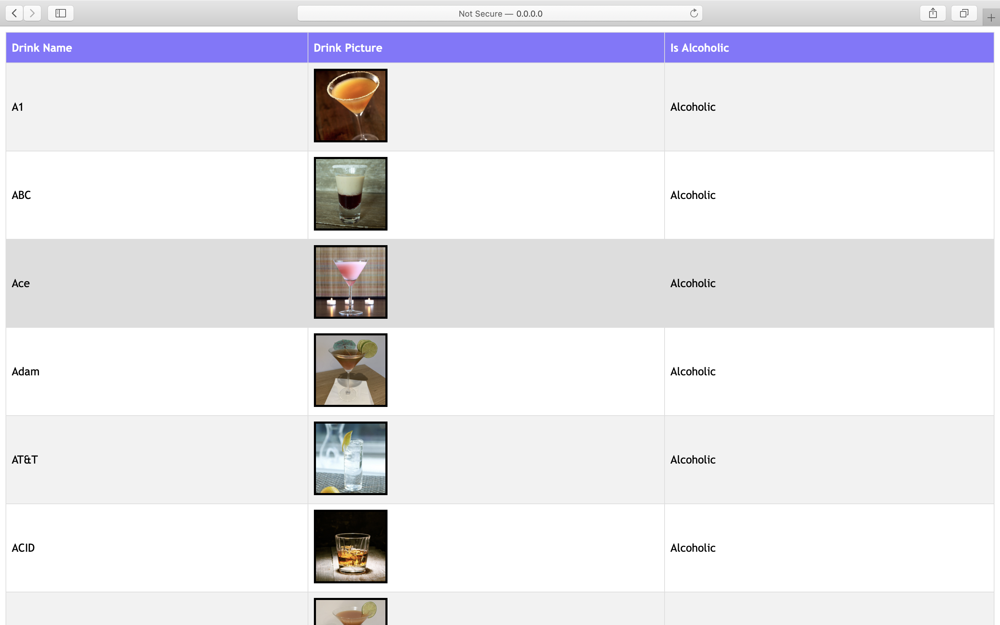

# Cocktail Explorer

This repo contains the source code of Cocktail Explorer web app.

### Setup
```
git clone git@github.com:mehmet-karadayi/Assignment-9.git
cd Assignment-9
virtualenv venv
source venv/bin/activate
pip install -r requirements.txt
```

### Run locally
To run the app on local host.
```
python views.py 
```

### Main Page
<br/><br/>

### Search Results
<br/><br/>

### Stack
- python 3.7
- Flask Web Framework
- HTML
- CSS
